# Hey, I'm Chandramouli 👋

### Engineering Student

  

  

  

---

## 👋 About Me

I'm an engineering student who likes building things and figuring out how they work.

I enjoy experimenting with software, AI/ML, and new technologies, mostly by turning random ideas into actual projects.

Still learning, still experimenting, and definitely still breaking things along the way. :)

---

## 🚀 Featured Projects

  <a href="https://github.com/ChandramouliJoshi/ApexEngineer-AI">ApexEngineer-AI ↗</a>
  &nbsp;&nbsp;•&nbsp;&nbsp;
  <a href="https://github.com/ChandramouliJoshi/animus.ai">animus.ai ↗</a>
  &nbsp;&nbsp;•&nbsp;&nbsp;
  <a href="https://github.com/ChandramouliJoshi/AI-Based-Semantic-Dataset-Recommendation-System">Semantic Dataset Recommendation ↗</a>

---

## 🛠️ Tech Stack

### Languages

  

  <b>Python&nbsp;&nbsp; C&nbsp;&nbsp; C++&nbsp;&nbsp; JavaScript&nbsp;&nbsp; HTML&nbsp;&nbsp; CSS</b>

### Development

  

  <b>React&nbsp;&nbsp; Next.js&nbsp;&nbsp; FastAPI&nbsp;&nbsp; PostgreSQL&nbsp;&nbsp; Supabase&nbsp;&nbsp; Vercel</b>

### AI / ML

  

  <b>PyTorch&nbsp;&nbsp; TensorFlow</b>

### Tools

  

  <b>Git&nbsp;&nbsp; GitHub&nbsp;&nbsp; VS Code</b>

---

## 📚 Currently Learning

> Figuring things out one project at a time.

- 🧩 Data Structures & Algorithms
- 🤖 Machine Learning & Deep Learning
- 🌐 Getting better at building web applications
- 🧠 Exploring AI and how it can be used to build useful things

---

## 📊 GitHub Activity

